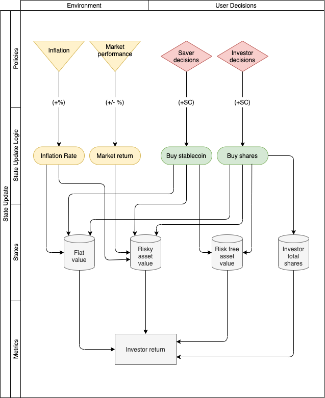

# National Stablecoin Model

**Work in progress**

## Abstract

Certain countries have been suffering inflation for decades. As a first approach, the possibility for their citizens to save using a Stablecoin backed and pegged by a stronger currency may seem a solution.
However, on a large scale, such a solution probably will cause a domestic currency run and aggravate the inflation.

This model is a naive approach of how a Stablecoin composed of different domestic type of assets may behave.

## Specification

For this first approach there are three type of assets pledged as a collateral and two different agents.

### Assets

1. Domestic currency: devaluates over time
2. Risky asset: devaluates like the currency, increase in value depending on the market return (e.g. ETF tracking market index)
3. Risk free asset: no devaluation, no returns (e.g. commodities contracts)

### Agents

1. Savers: no return expectations, expectation of not loosing purchasing power over time
2. Investors: expecting profits if market return is higher than inflation. In general their return will be the market return leveraged

### System definition

For clarification, a Stablecoin in this context is an asset that keep its purchasing power of a basket of goods over time.